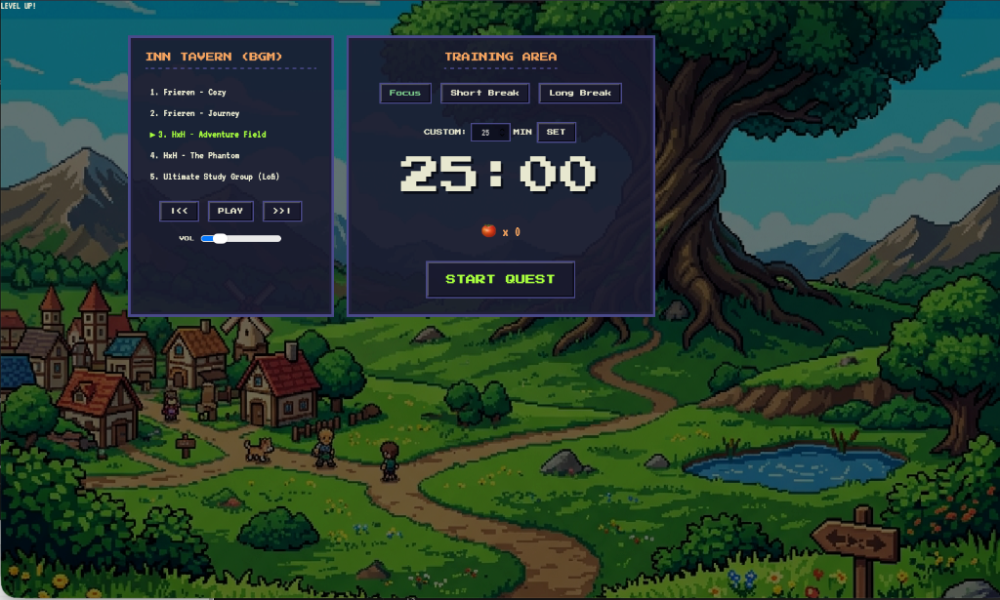
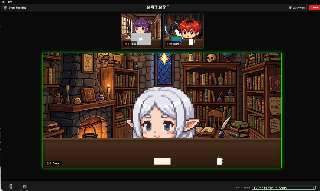

# 🎮 Pixel Quest Study App

Welcome to the **Pixel Quest Study App**, your ultimate virtual study room! This web application combines the productivity of Pomodoro timers with an immersive, anime-themed 16-bit pixel art environment.

## 🌟 Introduction

Do you get bored or lonely when studying by yourself? Pixel Quest transforms your study session into a lively Zoom-like video call with your favorite characters from *Frieren: Beyond Journey's End* and *Hunter x Hunter*.

**Key Features:**
- **Authentic Zoom Interface:** A fully responsive grid view that mimics a real Zoom call, complete with Gallery View, Speaker View, and mute icons.
- **Dynamic AI Characters:** The characters aren't just static images! They have custom JavaScript AI state machines. Watch them randomly type on their MacBooks, drink coffee, flip book pages, or even leave for bathroom breaks!
- **Lore-Accurate Backgrounds:** Every character sits in a unique pixel-art room generated specifically to match their anime lore (e.g., Frieren's magic room, Gon's bright island window, Hisoka's neon card room).
- **Pomodoro Timer:** Keep your focus sharp with customizable study blocks and break intervals.
- **Lofi YouTube Player:** Listen to carefully curated anime Lofi tracks directly within the app.
- **Live User Webcam:** You can even turn on your actual webcam to join the characters on-screen as the "Host"!

## 📸 Screenshots


*메인화면: 타이머 시간 및 BGM 트랙 설정 가능*


*Study Mode: 갤러리 뷰 (Hunter x Hunter 팀)*


*Study Mode: 발표자 뷰 (Hunter x Hunter 팀)*


*Study Mode: 발표자 뷰 (Frieren 팀)*

## 🚀 How to Use

### 1. Download the Project
First, get the code onto your computer. You can either download the ZIP file from GitHub or clone the repository using Git:
```bash
git clone https://github.com/lucytheboss/pixel-study-app.git
cd pixel-study-app
```

### 2. Setup & Launch
Since this is a client-side HTML/JS application, you can simply run it through any local HTTP server.
If you have Python installed, navigate to the project folder in your terminal and run:
```bash
python3 -m http.server 8080
```
Then, open your web browser and go to `http://localhost:8080`.

### 3. The Inn Tavern (Settings Mode)
When you first load the app, you will be in the "Settings" menu.
- **Select BGM:** Choose your preferred study group and Lo-fi track from the left panel. (Track 3: Ultimate Study Group puts all 9 characters on screen!)
- **Set Timer:** Set your Focus time, Short Break, or Long Break on the right panel. You can also input a custom timer up to 180 minutes.
- **Start Quest:** Click the big "START QUEST" button when you are ready to begin.

### 4. Study Mode (Zoom Call)
- **View Toggles:** Click `[🔳 View]` in the top right to switch between **Gallery View** (everyone on screen) and **Speaker View** (one large active speaker that changes periodically).
- **Webcam:** Click the `[📹 Start Video]` button on the bottom toolbar to turn on your actual computer webcam and appear alongside the characters! *(Your browser will ask for camera permission)*
- **Return to Settings:** Click the red `[Leave]` button at the top right to end the study session and choose a new timer or track.

---

*Enjoy your study sessions with the ultimate pixel-art anime study group!*
